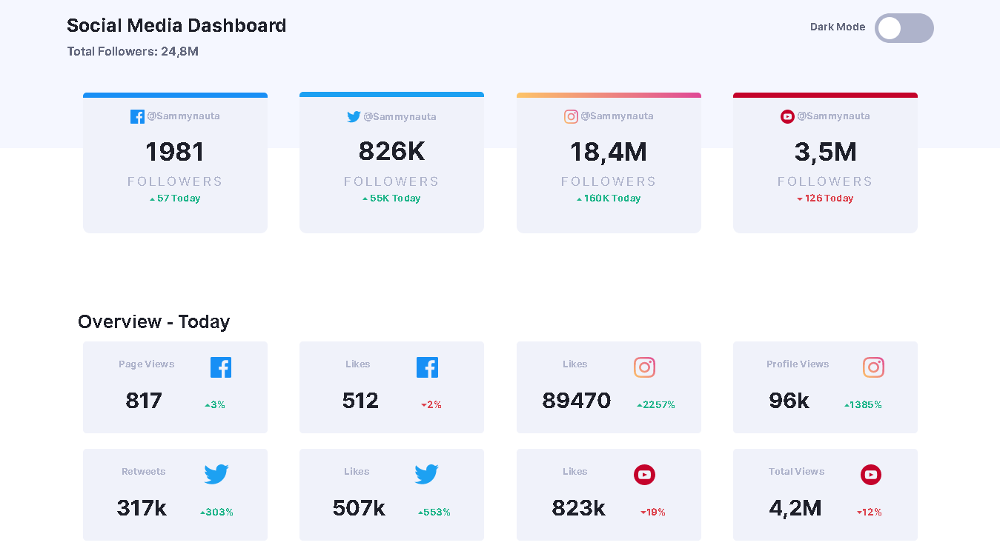
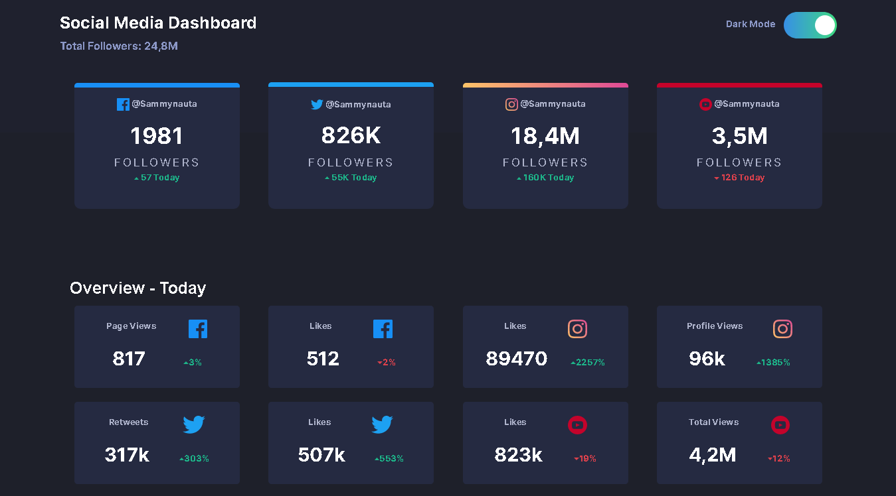
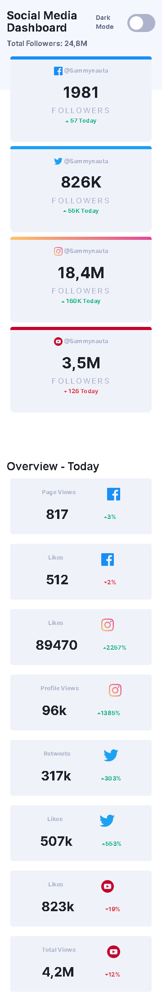
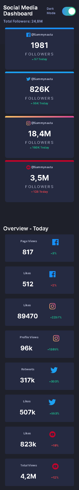

<h1 align="center">
SOCIAL MEDIA - FRONTENDMENTOR- NIVEL JUNIOR
</h1>

<a href="https://www.frontendmentor.io">frontendmentor Homepage</a> projeto de fim estudantil

## Sobre o Desafio
- Construir uma página e deixa-la o mais fiel a original como mostrada na pasta de Design.
- Aplicar todo conhecimento que puder para deixar agradável ao usuário. 
- Efetuar a versão Dark Mode da página.
- Ser responsiva.

## Participantes

[Sammynauta](https://github.com/Sammynauta)

## Recursos

- [x] HTML, CSS, JS
- [x] SVG Images
- [x] BOOTSTRAP

# Mobile 

